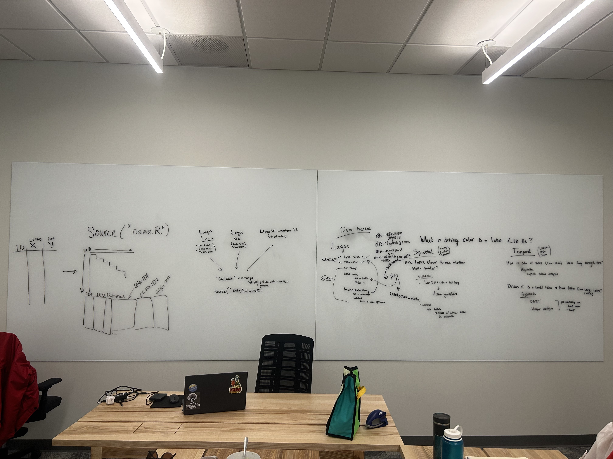

# Spatial and temporal patterns in small Western U.S. lakes

### Contributors: Sean B., Jordan B., Spencer C., Ashleigh P., Linnea R., Jordan V.

### Mentors: Carol B. and Bella O.

Code, data, and analyses for ECOL 5620 - Advanced Topics in Aquatic Ecology course, Spring 2023.

We are using LandSat and LAGOS data to investigate spatial and temporal patterns and drivers of lake color in lakes between 1 and 10ha in the Western U.S. states.

#### Questions

-   How are small (\<10 ha) lakes changing in color from 1984-2021?
-   Does proximity control how similar lakes are in color?

#### Group photos

Hard at work on April 13, 2023

